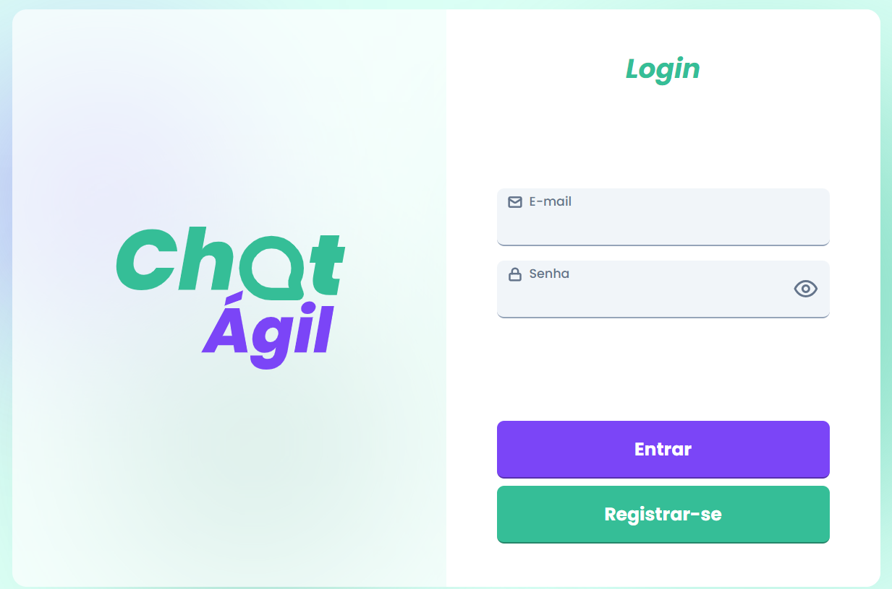

<h1 align="center">

</h1>

<h3 align="center">
  ChatÁgil 
</h3>

## ✅ Sobre o projeto

Projeto que foi desenvolvido como desafio feito pela UX Software, onde o objetivo era criar um chat em tempo real, com autenticação e autorização de usuários com Socket.io

## 🚀 Tecnologias

 
  
  

